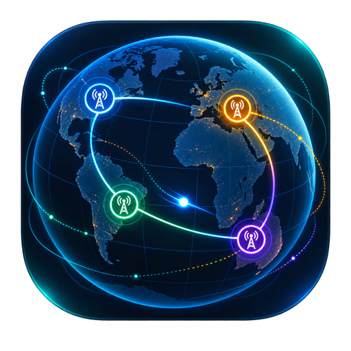
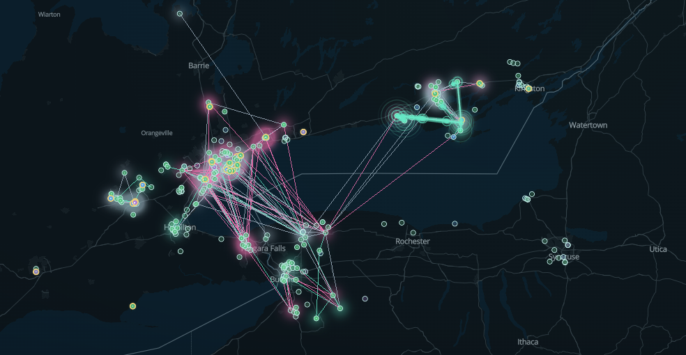
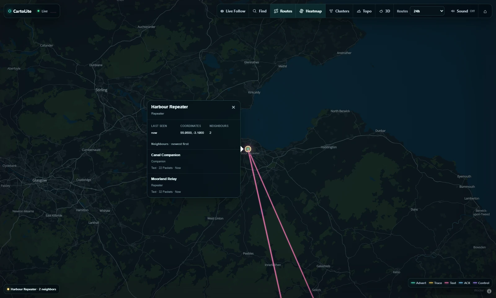
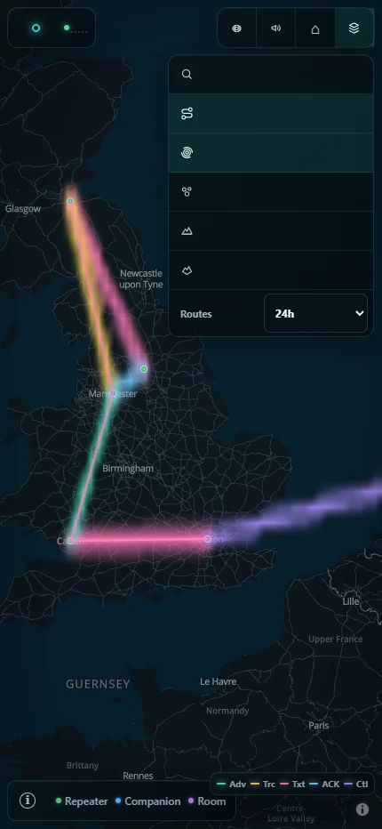

<p align="center">
  
</p>

<h1 align="center">CartoLite Server</h1>

<p align="center">
  <strong>A calm, musical live map for your MeshCore network.</strong><br>
  Turn a standard MQTT feed into a fast, privacy-safe topology experience you can host yourself.
</p>

<p align="center">
  <a href="https://github.com/n30nex/CartoLite-Server/releases/latest"></a>
  <a href="LICENSE"></a>
  <a href="https://github.com/n30nex/CartoLite-Server"></a>
</p>

<p align="center">
  <a href="#quick-start"><strong>Start self-hosting</strong></a> ·
  <a href="docs/deployment.md">Deployment guide</a> ·
  <a href="docs/privacy.md">Privacy boundary</a> ·
  <a href="https://github.com/n30nex/CartoLite-Server/releases/latest">Latest release</a>
</p>



<p align="center"><sub>Real CartoLite interface shown with synthetic demonstration traffic. No production network data is included.</sub></p>

## See your mesh move

CartoLite Server renders public MeshCore activity as a living map: packet trails travel hop by hop, recently heard routes hold a restrained glow, and packet types keep distinct colours. Optional Web Audio turns every visible live hop into a musical articulation.

<table>
  <tr>
    <td width="68%">
      
    </td>
    <td width="32%">
      
    </td>
  </tr>
  <tr>
    <td align="center"><sub>Inspect a node, its newest neighbours, and connected routes.</sub></td>
    <td align="center"><sub>Touch-friendly controls keep the map primary on phones.</sub></td>
  </tr>
</table>

## Built for community operators

| | |
|---|---|
| **Live topology** | Vector geography, packet trails, route glow, packet-type heat, clusters, hillshade, and 3D terrain. |
| **Find and inspect** | Search downloaded node labels, open node details, and browse neighbours sorted by last heard. |
| **Musical traffic** | Opt-in Aurora, Wood, and Chimes scenes using native browser audio and visible live hops only. |
| **Works worldwide** | Accept valid coordinates anywhere, or apply an exact region allowlist for a shared broker. |
| **Responsive and resilient** | Desktop and phone layouts, Live Follow, saved views, and automatic recovery after sleep or network loss. |
| **Small operational footprint** | One dependency-light Go service, one atomic checkpoint, no database, and a hardened container. |

## Privacy is the product boundary

The public API exposes only the minimum sanitized data needed to draw the live topology. CartoLite Server does **not** publish public keys, observer keys, raw paths, packet bodies, decoded messages, or resolver details. It includes no visitor analytics, accounts, chat, or message history.

See the exact guarantees in the [privacy documentation](docs/privacy.md) and the stable [public API v2 contract](docs/public-api.md).

## Quick start

You need Docker Engine, Docker Compose v2, a standard MeshCore MQTT feed, and your own CARTO Basemaps browser key.

> [!IMPORTANT]
> No API keys, passwords, or tokens are bundled with this repository. `.env` and `.secrets/` are excluded from Git and the Docker build context.

1. Copy `.env.example` to `.env`.
2. Create `.secrets/carto-basemap-api-key` and place only your CARTO browser key in it.
3. Set `MQTT_BROKER_URL`, `MQTT_TOPIC`, and any optional MQTT credentials in `.env`.
4. Build and start your instance:

```sh
docker compose build --pull
docker compose up -d
curl --fail http://127.0.0.1:8080/readyz
```

The default bind is loopback-only. Keep it that way behind a TLS reverse proxy, or deliberately set `CARTOLITE_BIND_ADDR=0.0.0.0` for trusted LAN access. The [deployment guide](docs/deployment.md) covers production configuration and updates.

## MQTT input

The subscriber defaults to `meshcore/#` and accepts the standard topic shape:

```text
meshcore/<region>/<publisher-key>/packets
meshcore/<region>/<publisher-key>/status
```

`REGION_ALLOWLIST` is empty by default, so every syntactically valid region is accepted. Set it to exact comma-separated labels such as `EU_WEST,AU_NSW` when a shared broker should feed separate public maps. Use `MQTT_TOPIC` to narrow the subscription itself.

The server accepts the standard packet/status JSON or raw packet hex published by a MeshCore MQTT bridge. Unknown topic shapes and malformed messages are counted and ignored.

## Basemap key

Docker supplies the CARTO key to the web build through a BuildKit secret. It stays out of source, Compose, image labels, and build logs. Like any browser map credential, it is visible to visitors in tile requests after deployment, so use a CARTO project key restricted for your site.

CartoLite Server does not publish a universal prebuilt image because each operator builds the frontend with their own browser-visible basemap key.

## Project scope

This repository contains the standalone server and browser map. It has no country boundary, default region allowlist, Android app, Labs, analytics, database, chat, history, or operator dashboard.

## Documentation

- [Deployment](docs/deployment.md)
- [Architecture](docs/architecture.md)
- [Privacy boundary](docs/privacy.md)
- [Public API v2](docs/public-api.md)
- [Data sources](docs/data-sources.md)
- [Sound and animation](docs/sound-and-animation.md)
- [Security policy](SECURITY.md)

## License

[MIT](LICENSE). CartoLite Server is derived from the CartoLite map system and keeps its privacy-first public-data boundary.
